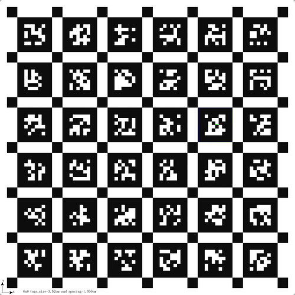

AprilTag
========

.. image:: https://github.com/chutsu/apriltag/workflows/ci/badge.svg
  :target: https://github.com/chutsu/apriltag/actions?query=ci

This repo is a copy of Michael Kaess' AprilTag implementation in C++. The
original AprilTag was developed by Ed Olsen:

    Ed Olson, AprilTag: A robust and flexible visual fiducial system,
    Proceedings of the IEEE International Conference on Robotics and
    Automation (ICRA), 2011

but it has been **extended** with:

1. An :code:`AprilGridDetector` to facilitate detecting a grid of AprilTags
   (used for camera calibration):

2. **Python3 bindings**. Example code
   (:code:`apriltag/examples/test_aprilgrid.py`):

.. code-block:: python

    import cv2
    import apriltag_pybind as apriltag

    # Load image
    img = cv2.imread("aprilgrid.jpeg", cv2.IMREAD_GRAYSCALE)
    tag_data = apriltag.detect(img)

    # Detect
    viz = cv2.cvtColor(img, cv2.COLOR_GRAY2BGR)
    for (tag_id, corner_idx, kp_x, kp_y) in tag_data:
        pt = (int(kp_x), int(kp_y))
        radius = 5
        color = (0, 0, 255)
        thickness = 2
        cv2.circle(viz, pt, radius, color, thickness)

    # Visualize
    cv2.imshow("Viz", viz)
    cv2.waitKey(0)

Build
-----

There are make targets for convenience:

.. code-block::

    make deps
    make build
    make install
    make run_python_example
    make clean

alternatively you can issue standard cmake build commands:

.. code-block::

    mkdir -p build
    cd build
    cmake .. -DBUILD_PYBINDS=ON
    make
    sudo make install

LICENCE
-------

GNU LGPL version 2.1.
